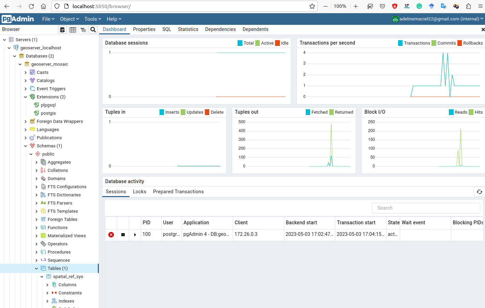
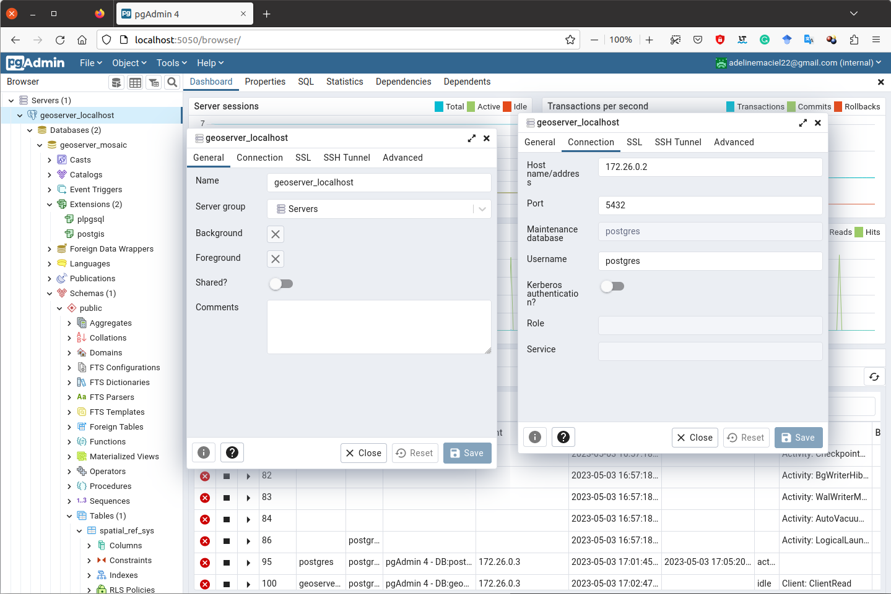
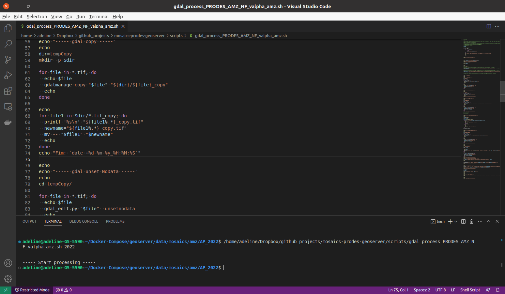
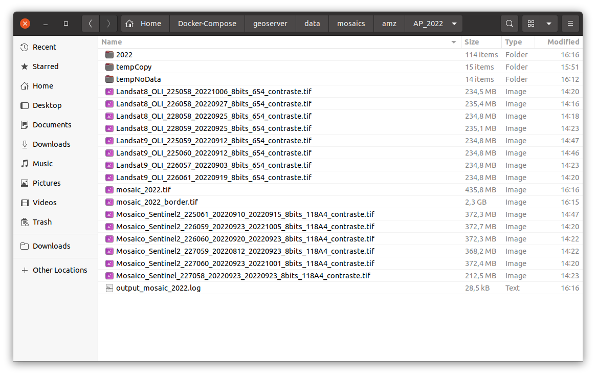
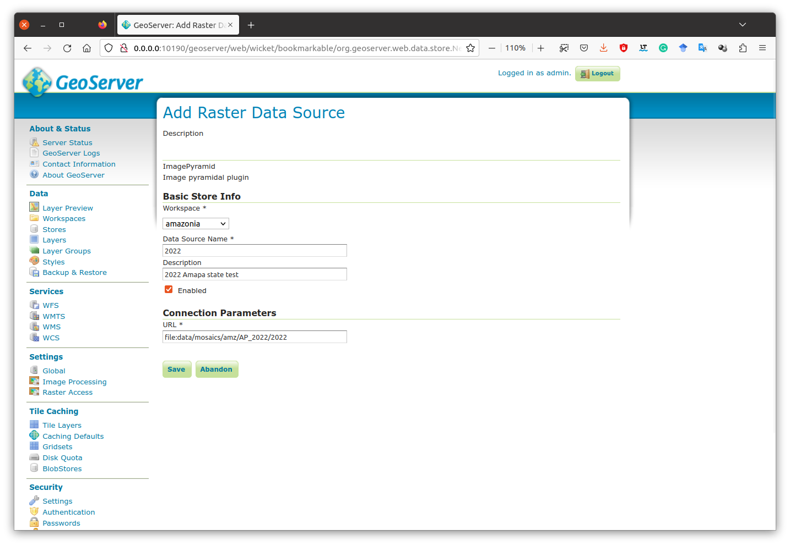
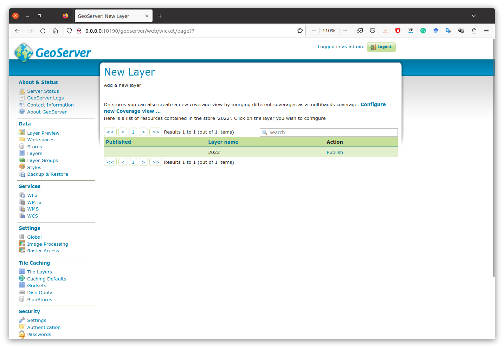
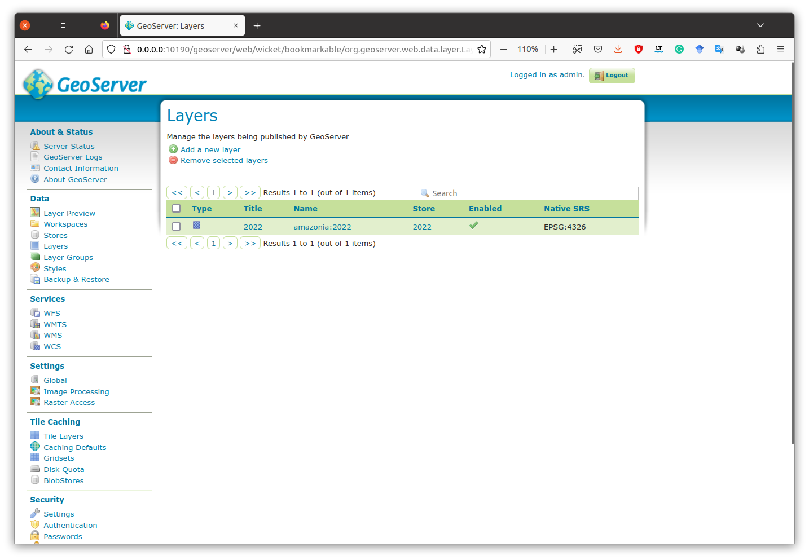
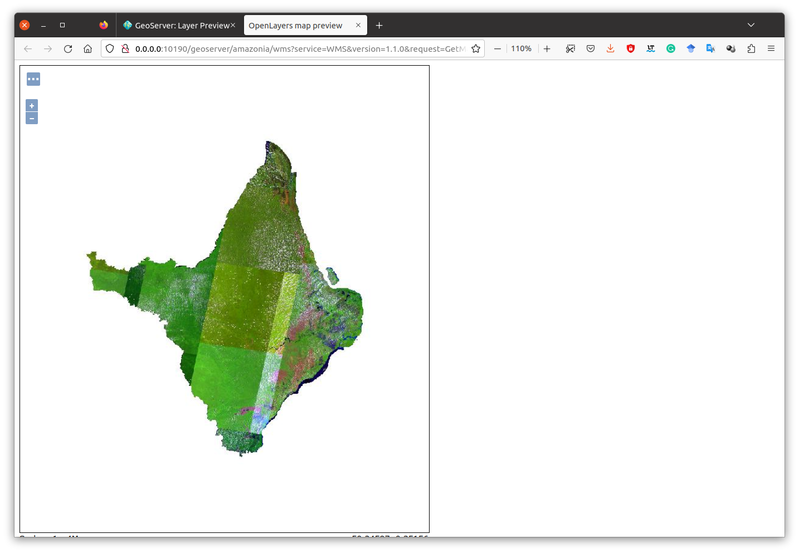
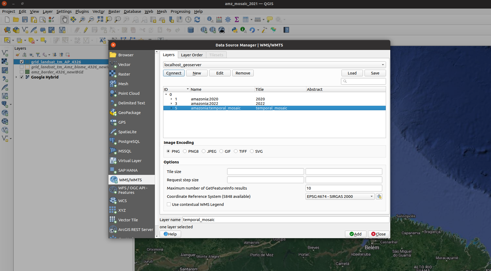
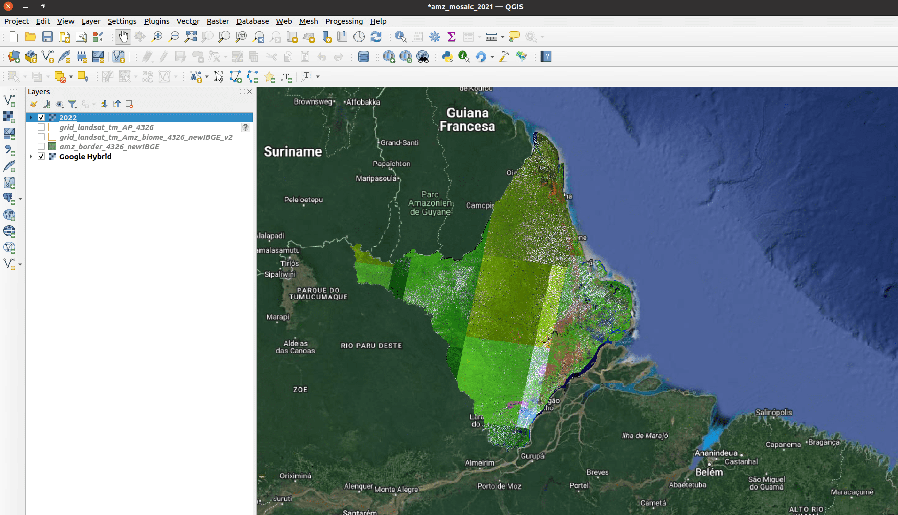

# mosaics-prodes-geoserver

[](https://github.com/terrabrasilis/geoserver-mosaics/blob/master/LICENSE)


<!--  -->

These scripts will automatically build mosaics to create tiled raster (image pyramid) with GeoServer. All scripts have been developed on Linux operating system, Ubuntu 20.04.

# Directory Guide and Input Data

There are three main directories: first with source codes that contain the scripts to create the mosaics, developed using Shell Script, R language and gdal 3.4.3; shapefiles, with the shapefiles of the border of the Amazon biome and Landsat Grid of the biome; and geoserver, with scripts and configuration files to Geoserver Image Pyramid.

All the images must be in Geotiff (.tif) raster file format. And, all of them must have the correct Landsat path and row in filename where appropriate and possible, i.e, "Landsat8_OLI_232062_20200729_8bits_654_contraste.tif".

For each script is necessary to edit the contents of the variable "shapefile" and put the path to shapefile with the biome limits. The shapefile must be in the geographic coordinate system EPSG:4326.

When the script has the "rscript_file" variable, is used an R script to cut each image by your Landsat grid scene to avoid border overlap. In this case is necessary the Landsat grid shapefile contains a feature called "pathrow" in the format of 5 digits 00527, and not in 005/27.

# Usage

## Dependencies
- [Python](https://www.python.org/) (>= 2.7);
- [GDAL](https://gdal.org) (>= 3.0);
- [GeoServer](http://geoserver.org/) (>= 2.13.0) with Image Pyramid extension;
- [R](https://www.r-project.org/) (>= 3.6.2);
- Geographic Information System (GIS) to add layer and visualize the mosaic via Web Map Service (WMS), e.g., [QGIS](https://qgis.org/en/site/#);
- [Docker](https://www.docker.com/) and [Compose](https://docs.docker.com/compose/install/);
- [PostgreSQL](https://www.postgresql.org/) and spatial database extension [Postgis](https://postgis.net/).

You can use docker to run some of these applications in containers. You may need to install missing dependencies before you can install applications. The Docker Compose file is a YAML file defining services, networks and volumes. In docker folder there are examples of .yml files, before run then, create a Docker-Compose folder in localhost and change path in files.


## Command line

The scripts can be run on your system as follows:

```bash
user@machine:~/[directory_with_raster_year]$ /[path_to_repository]/mosaics-prodes-geoserver/scripts/gdal_process_PRODES_AMZ_NF_valpha_amz.sh [year]
```
Example:

```bash
user@machine:~/Downloads/images_cer/im_2010$ /home/user/Downloads/mosaics-prodes-geoserver/scripts/gdal_process_PRODES_AMZ_NF_valpha_amz.sh 2010

```
## Output

The scripts create intermediate folders and GeoTIFF files. By default, the folder named with "year" is used as input of Image Pyramid GeoServer, move this folder to the directory of GeoServer data. After script execution, the intermediate files and folders can be removed to the trash.


# Geoserver

An [Image Pyramid](https://docs.geoserver.org/latest/en/user/tutorials/imagepyramid/imagepyramid.html) is several layers of an image rendered at various image sizes, to be shown at different zoom levels.

After copying the year_folder to Geoserver repository in the server, and assuming the GeoServer image pyramid plug-in is already installed, it’s possible to create the coverage store by pointing at the directory containing the pyramid.

In the case of set of image pyramids, one per year, it is necessary:
- create a database called "geoserver_mosaic" in PostgreSQL with postgis extension;
- create a folder named "mosaics_raster" and move all year_folder into. After this, for each year_folder create new stores with Image Pyramid plugin in Geoserver with year as names of the layer;
- in the server folder, creates a new directory named, for instance, 'temporal_mosaic' and copy all year_folder into them, for this use the  "1.copy_mosaic_each_level.sh" script with correct parameters;
- copy the main three files to the 'temporal_mosaic' folder and subdirectories (0, 1, 2, 3, 4): datastore.properties (change before with correct parameters, i.e., name database, port, pass, user, ...), indexer.properties and timeregex.properties, to do this use the  "2.copy_properties_each_level.sh" script with correct parameters;
- finally, create new stores with Image Pyramid plugin in Geoserver with "temporal_mosaic" as the name of the layer and the correct path.
- open the pgAdmin and check if the indexes table (0,1,2,3,4) were created in database "geoserver_mosaic" by Image Pyramid Geoserver

The output directory is look like this:

Root directory("temporal_mosaic/"):
```bash
0
1
2
3
4
datastore.properties
indexer.properties
temporal_mosaic.prj
temporal_mosaic.properties
timeregex.properties
```

The top of "temporal_mosaic/4/"
```bash
4.properties
datastore.properties
indexer.properties
mosaic2000_1_1.tif
mosaic2000_1_2.tif
mosaic2000_2_1.tif
mosaic2000_2_2.tif
```

And the bottom of "temporal_mosaic/4/"
```bash
mosaic2022_2_3.tif
mosaic2022_2_4.tif
mosaic2022_3_1.tif
mosaic2022_3_2.tif
sample_image.dat
timeregex.properties
```
Other directories have the same configuration.

The configuration files to ImageMosaic are (remember, these three, 3, files must be replicated in each directories 0, 1, 2, 3 and 4 (./2.copy_properties_each_level):

datastore.properties
```bash
SPI=org.geotools.data.postgis.PostgisNGDataStoreFactory
host=172.26.0.2
port=5432
database=geoserver_mosaic
schema=public
user=postgres
passwd=postgres
Loose\ bbox=true
Estimated\ extends=false
validate\ connections=true
Connection\ timeout=10
preparedStatements=true
```

indexer.properties
```bash
TimeAttribute=time
Schema= the_geom:Polygon,location:String,time:java.util.Date
PropertyCollectors=TimestampFileNameExtractorSPI[timeregex](time)
```

timeregex.properties
```bash
regex=[0-9]{4}
```

## Geoserver Layers - Web Interface

In the Layers section of the web interface, you can view and edit existing layers, add (register) a new layer, or remove (unregister) a layer. The Layers View page displays the list of layers, and the Store and Workspace in which each layer is contained. The View page also displays the layer’s status and native SRS.

To view or edit a layer, click the layer name. A layer configuration page will be displayed. The Data tab, activated by default, allows you to define and change data parameters for a layer. Both vector and raster layers, the publishing task into the GeoServer is the same. Following the configuration below, it can be possible to configure the Geoserver to preview all the mosaic's years.

In geoserver - Layers / Edit Layer

- Dimensions tab
	- Enabled the Time in the checkbox
	    - Presentation - List
	    - Default value - Use the smallest domain value
	- Save

- Tile Caching tab
	- Tile cache configuration
	- Enable "Create a cached layer for this layer"
	- Add filter: TIME
	- Choose One: List of Strings  (+) click
	- Default String
		2000-01-01T00:00:00.000Z
	- Allow String(one per line)

        For instance, for Legal Amazon Mosaic
        ```bash
        2000-01-01T00:00:00.000Z
        2001-01-01T00:00:00.000Z
        2002-01-01T00:00:00.000Z
        2003-01-01T00:00:00.000Z
        2004-01-01T00:00:00.000Z
        2005-01-01T00:00:00.000Z
        2006-01-01T00:00:00.000Z
        2007-01-01T00:00:00.000Z
        2008-01-01T00:00:00.000Z
        2009-01-01T00:00:00.000Z
        2010-01-01T00:00:00.000Z
        2011-01-01T00:00:00.000Z
        2012-01-01T00:00:00.000Z
        2013-01-01T00:00:00.000Z
        2014-01-01T00:00:00.000Z
        2015-01-01T00:00:00.000Z
        2016-01-01T00:00:00.000Z
        2017-01-01T00:00:00.000Z
        2018-01-01T00:00:00.000Z
        2019-01-01T00:00:00.000Z
        2020-01-01T00:00:00.000Z
        2021-01-01T00:00:00.000Z
        2022-01-01T00:00:00.000Z
        ```

# Online Resource

- [Image Pyramid](https://docs.geoserver.org/stable/en/user/tutorials/imagepyramid/imagepyramid.html)
- [Building and using an image pyramid](https://docs.geoserver.org/latest/en/user/tutorials/imagepyramid/imagepyramid.html)
- [Advanced Mosaics and Pyramids Configuration](https://docs.geoserver.geo-solutions.it/edu/en/raster_data/mosaic_pyramid.html)
- Download [shapefile](http://terrabrasilis.dpi.inpe.br/downloads/) with biomes and Legal Amazon border.
- [GeoServer - Layers](https://docs.geoserver.org/2.23.x/en/user/data/webadmin/layers.html)

# Screenshots

Example configure database





<!--  -->

Run the script in the same folder with images. This process will create a log file in this folder with all outputs of the execution, as can see in the picture of the folder. Besides a set of auxiliary files. The main folder will be with the year in its name. This folder will be input in the Geoserver to process with Image Pyramid. Example with a small area, Amapá state, Brazil.






In Geoserver, add new store using Image Pyramid Plugin and add raster data source. After this, edit layer information and view the preview.









Then, open in QGIS as a WMS layer.





