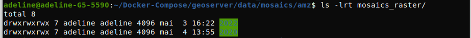
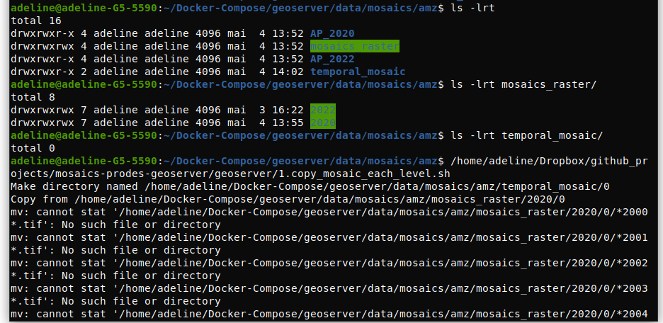
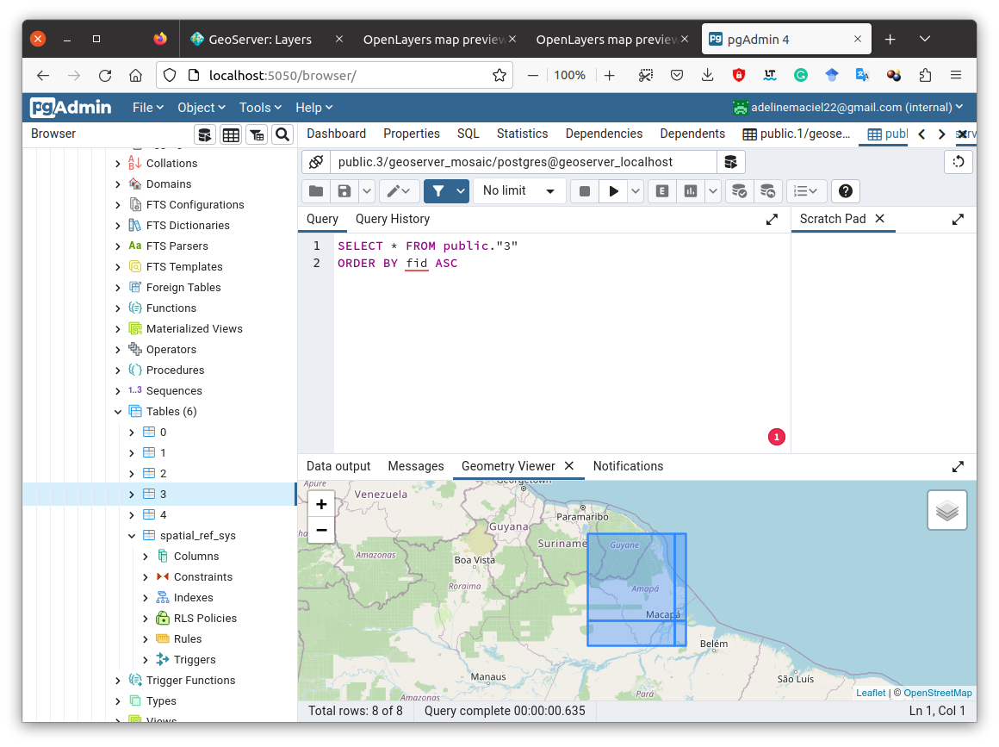
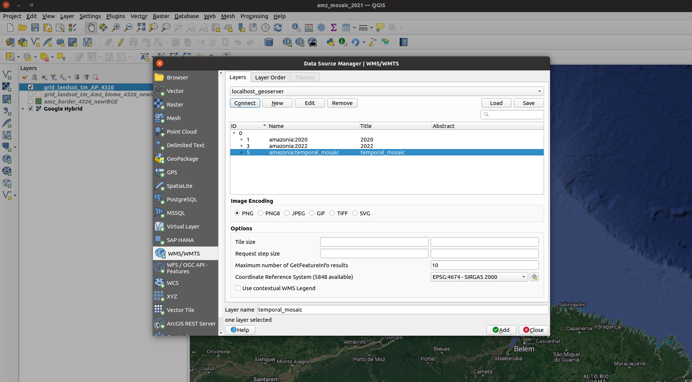
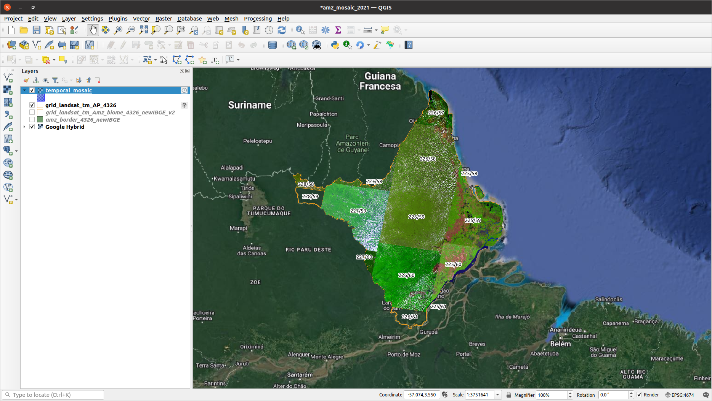

""""""""""""""""""""""""""""""""""""""""""""""""""""""""""""""
How create a temporal mosaic in Geoserver
""""""""""""""""""""""""""""""""""""""""""""""""""""""""""""""
+++++++++++++++++++++++++++++++++++++++++++++++++++++++++++
Tutorial to create temporal mosaic using Image Pyramid
+++++++++++++++++++++++++++++++++++++++++++++++++++++++++++

.. contents:: Overview
   :depth: 3

============
Database
============

First, create a database called "geoserver_mosaic" and add spatial extension PostGIS.

.. image:: img/database.png
  :width: 700
  :alt: Database

.. image:: img/database_config.png
  :width: 700
  :alt: Database

====================
Rasters processing
====================

--------------------------------------------------------------------
Download raster files
--------------------------------------------------------------------

Download all raster files, in GeoTIFF format, to one or more years and place them in a folder identified by name_year.

--------------------------------------------------------------------
Run script to generate the retiles
--------------------------------------------------------------------

For each name_year run the shell script, located in script folder, to generate the retiles, that is a set of tiles and/or build tiled pyramid levels.
Run the script in the same folder with images. This process will create a log file in this folder with all outputs of the execution, as can see in the pictures of the folders. Besides a set of auxiliary files. The main folder will be with the year in its name.
This folder will be input in the Geoserver to process with Image Pyramid. For example, with a small area, Amapá state, Brazil to the 2022 year. As result, in the folder will be generated a set of auxiliary files, such as, "temp*" folders, "mosaic_*" files, and a log file with all output of the script. Repeat this process for each name_year folder. The main file generated is the folder named by "year" folder. Examples show AP_2020 and AP_2022 folders and results after the shell script run.

============
Geoserver
============

After copying the "year" folder to Geoserver repository in the localhost, and assuming the GeoServer image pyramid plug-in is already installed, it’s possible to create the coverage store by pointing at the directory containing the pyramid.

Create a folder named "mosaics_raster" and move all "year" folder into. After this, for each "year" folder create new stores with Image Pyramid plugin in Geoserver with year as name of the layer;

--------------------------------------------------------------------
For each "year" folder create a Image Pyramid
--------------------------------------------------------------------

In Geoserver, for each "year" folder create a new store using Image Pyramid Plugin and add raster data source. After this, edit layer information and view the preview. Example with "2020" folder.

.. image:: img/geoserver_addlayer2.png
  :width: 700
  :alt: Geoserver

.. image:: img/geoserver_addlayer4.png
  :width: 700
  :alt: Geoserver

--------------------------------------------------------------------
Copy files from "mosaics_raster" to "temporal_mosaic" folder
--------------------------------------------------------------------

After creating an Image Pyramid in Geoserver for each year. Creates a new directory named, for instance, "temporal_mosaic" and copy from  "mosaics_raster" all "year" folders into it, from the into them. To do this, use the  "1.copy_mosaic_each_level.sh" script with correct parameters. Before, apply the Linux chmod command to change the access permissions of files and directories to "mosaics_raster" directory and subdir: "chmod -R 777 mosaics_raster".

--------------------------------------------------------------------
Add .properties files into "temporal_mosaic" folder
--------------------------------------------------------------------

In this stage, copy the main three files to the "temporal_mosaic" folder, datastore.properties (change before with correct parameters, i.e., name database, port, pass, user, ...), indexer.properties and timeregex.properties. After this, run  "2.copy_properties_each_level.sh" script with the correct parameters, which will copy the three files for each subdirectories (0, 1, 2, 3, 4).  Figures show this process.

====================================
Geoserver temporal_mosaic
====================================

Finally, create new store with Image Pyramid plugin in Geoserver with "temporal_mosaic" as the name of the layer and the correct path. The figures below show this process.

.. image:: img/temporal_mosaic_geo1.png
  :width: 700
  :alt: Geoserver

---------------------
Check the Database
---------------------

Only to check, open the pgAdmin and check if the indexes table (0,1,2,3,4) were created in database "geoserver_mosaic" by Image Pyramid Geoserver, and see the temporal layers in the application.

================
Visualization
================

--------
QGIS
--------

Visualize mosaic temporal in QGIS via a WMS layer.

------------------------
Geoserver link
------------------------

Or accessing Geoserver link, like this example,  [`http://0.0.0.0:10190/geoserver/amazonia/wms?service=WMS&version=1.1.0&request=GetMap&layers=amazonia:temporal_mosaic&styles=&bbox=-54.876893,-1.23599921738996,-49.8668862367665,4.476636&width=673&height=768&srs=EPSG:4326&format=application/openlayers&TIME=2022`], changing the parameter TIME=YEAR by the interest year.

